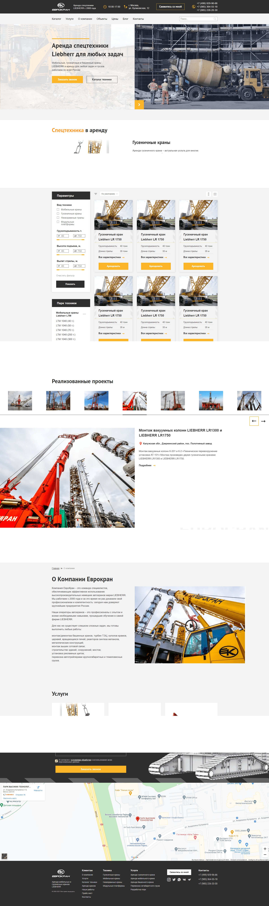

### [Eurocran - многостраничный сайт.](https://stalise.github.io/Eurocran/)
Адаптивно-отзывчивая верстка до 320px. Реализована с различными вариациями слайдера. Применение JavaScript и сборка через GULP. Количество страниц - 9.  
Мой самый большой проект по верстке. Является доработанной версией реального сайта - [ссылка](https://www.eurocran.su/)

##### Стек:
* HTML
* SCSS
* JS
* GULP

##### Библиотеки и плагины:
* Swiper
* UiSlider
* SelectJs

##### Обзор:  

